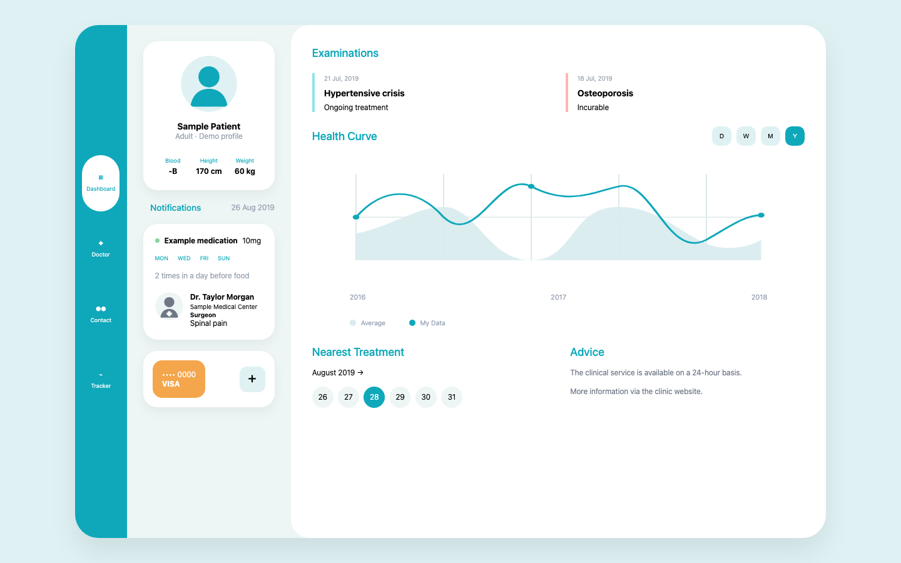

# Medical WebApp Template

A static HTML/CSS template for a medical dashboard. It includes dashboard, clinician, contact, and meal-tracking views.

## Run locally

Open `index.html` in a browser. No build step or dependencies are required.

All content is fictional sample data. Replace it before using the template in a project.

## License

No license has been added yet. Unless the repository owner adds one, copyright is reserved and reuse is not granted by default.
